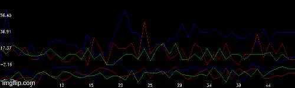

# TDM-GA_2D

Team Death Match 2d version with AI

## Introduction:
This repository is an aplicattion of reiforcement learning to a simple game of team death match in 2D.

Introductory video: need to add link

## Dependencies:
 - *opencv*
#### How to install:
To compile and run this program you will need opencv for c++. It can be installed just by following this tutorial:
https://docs.opencv.org/trunk/d7/d9f/tutorial_linux_install.html

#### How to run:
After installing the dependecies, go to the selected directory and run the makefile:

`make all`

If the compiling process worked, run the program:

`./tdm-GA.o`

When you start the program you will be asked if you want to start an evolution process or load the neural network that has already been trained. If you select "evolution" it will apear the option to save your evolution data. In that case the fitness plot will be saved at each 50 generations and the neural network at each 20 generations. In both choices ("evolution" or "load file") you will be asked to insert an directory or a filepath, respectively.

## Results:
After envolving for 5000 generations, the players learn how to move around and aim on the enemy players:

#### Fitness:

#### Game:

